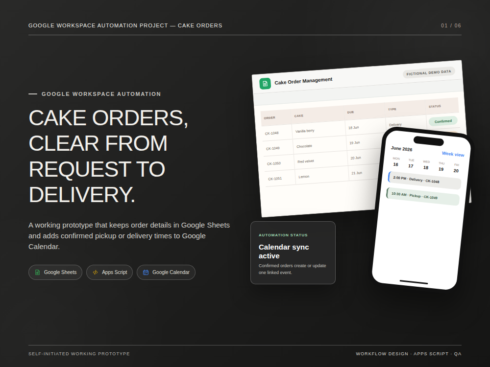
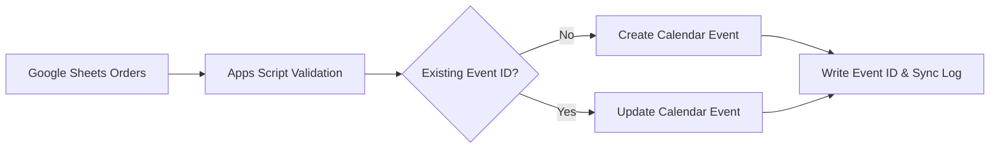

# Google Workspace Order & Calendar Automation

A working Google Workspace automation prototype for a custom-order business. Confirmed orders in Google Sheets are validated and synchronized to Google Calendar, with duplicate prevention, event updates, and an auditable sync log.

> Portfolio note: all people, orders, dates, prices, and dashboard figures in this repository are fictional sample data.

## Business problem

Manually copying orders into a calendar is repetitive and error-prone. Updates can create duplicate events, incomplete orders can reach production, and teams have no reliable record of what synchronized successfully.

## Solution

- Reads confirmed orders from a structured Google Sheet.
- Validates required order and scheduling fields before processing.
- Creates a linked Calendar event and stores its event ID.
- Updates the existing event when an order changes instead of creating duplicates.
- Records success, skip, and error outcomes in a synchronization log.
- Adds a custom **Cake Orders** menu for non-technical users.

## Workflow

## Technology

Google Apps Script, Google Sheets, Google Calendar, JavaScript, CSV sample data, and browser-based portfolio rendering.

## Try the prototype

1. Create a Google Sheet and import `sample-orders.csv` as the `All Orders` tab.
2. Open **Extensions → Apps Script** and add `apps-script/Code.gs`.
3. Authorize Spreadsheet and Calendar access.
4. Reload the spreadsheet and use the **Cake Orders** menu.

Use a test spreadsheet and calendar first. Review the script before granting permissions.

## Included

- `apps-script/Code.gs` — installable automation.
- `sample-orders.csv` — fictional input data.
- `portfolio-images/` — six-slide visual case study.
- `Cake-Order-Management-Portfolio.pdf` — downloadable case study.
- `portfolio-source.html` and `render-portfolio.mjs` — editable presentation source.

## Security

See [SECURITY.md](SECURITY.md). This repository does not require or include API keys.

## About the Developer

Built by [Agung Pamilu](https://github.com/agung-full-dev), a Full-Stack Web Developer & Automation Specialist. [LinkedIn](https://www.linkedin.com/in/agung-pamilu-704757197/) · [Email](mailto:agungpamilu504@gmail.com)
